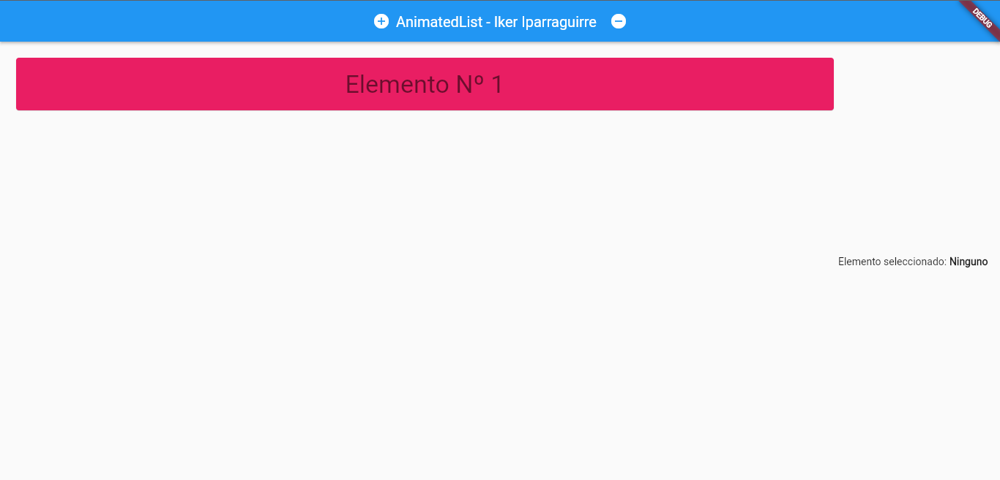

# AnimatedList - Iker Iparraguirre

Ejemplo de AnimatedList.

Como se puede observar en la imagen esta es la aplicacion de ejemplo que he creado para mostrar el funcionamiento de AnimatedList.  
Al ejecutar, se muetra un elemento ya creado, pulsando sobre el boton "+" se crean nuevos elementos con el nombre "Elemento Nº " + el numero de elemento.  
Si pulsamos sobre un elemento se podra observar que cambia el color del texto a verde y que a la derecha cambia el mensaje "Elemento seleccionado: " al elemento seleccionado.  
Para eliminar un elemento habra que seleccionar el elemento y despues pulsar sobre el boton de "-".
## [Repositorio de GitHub](https://github.com/ikeriparraguirre/widget_AnimatedList)

